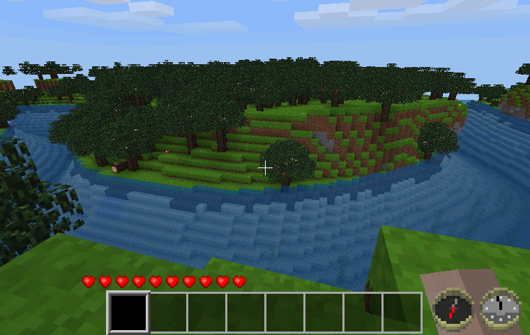

HUD Compass [hud_compass]
-------------------------

A Minetest mod to optionally place a HUD compass in the bottom right corner of the screen.

By David G (kestral246)

How to enable
-------------

This mod defaults to not displaying compass. To enable, use the chat command:

> "/compass"

Repeated use of this command will toggle the compass display off and on.

Local mod storage is used to maintain state of hud_compass display between sessions, per user.

Licenses
--------
Source code

> The MIT License (MIT)

Media (textures)

> Attribution-ShareAlike 3.0 Unported (CC BY-SA 3.0)

> (Textures were copied from my realcompass mod, which were originally based on the textures created by tacotexmex for the ccompass mod.)
 

